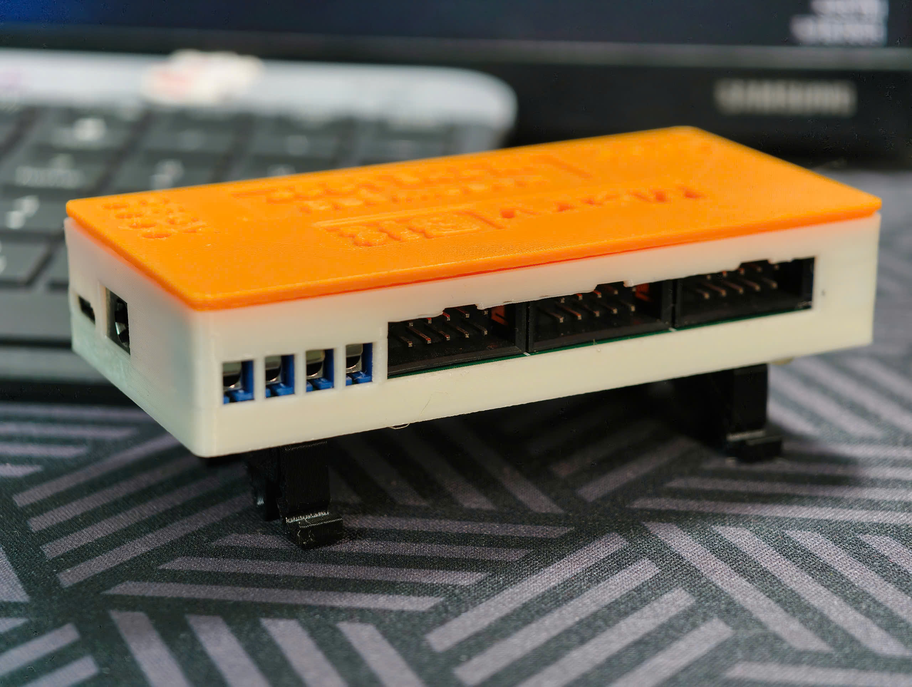

# ESP32-S3 HIL Tester: Compact Hardware-in-the-Loop Solution

The ESP32-S3 HIL Tester is an open-source, versatile tool designed to simplify device testing by simulating real-world hardware interactions. Traditional testing methods often require physical connections to hardware and peripherals, which can be costly, complex, and time-consuming. This HIL tester overcomes these challenges by offering a wide range of I/O, peripherals, ADC, and DAC capabilities to emulate hardware environments efficiently.

Powered by the ESP32-S3 SoC with WiFi and BLE connectivity, the tester is housed in a compact, 3D-printed enclosure. Its lightweight, portable design makes it ideal for developers and engineers testing equipment across various scenarios.

## Features
- **Up to 24V logic and power support**: Support I/O with voltage up to 24V, supporting wide range of peripheral device.
- **Current Sensing**: Monitors Device Under Test (DUT) current using INA226 for precise analysis.
- **ADC & DAC**: Supports diverse simulation scenarios with ADS1115 ADC and MPC4728 DAC.
- **Power & Connectivity**: Includes a DC power port and USB Type-C for programming and debugging.
- **Wireless Communication**: WiFi and BLE enable seamless remote operation.
- **Industrial Interfaces**: Features CAN (SN65HVD230) and RS485 (SP3485) transceivers for robust communication.
- **Temperature Sensing**: Dual temperature sensor ports for environmental monitoring.

## Mechanical Design

- **Design Tool**: Created using Fusion 360.
- **Enclosure**: Fully 3D-printed using a Bambu Lab A1 Mini with PETG filament for durability and portability.

  
  

## Circuit Design

- **Design Tool**: Developed using Altium Designer.
- **Key Components**:
  - ESP32-S3 as the main controller.
  - 2x INA226 for current measurement.
  - 2x ADS1115 ADC for high-precision analog input.
  - MPC4728 DAC for analog output.
  - SN65HVD230 CAN transceiver.
  - SP3485 RS485 transceiver.
  - Dual temperature sensor ports.
  - Multiple I/O interfaces: UART, I2C, SPI, PWM, and more.
  - USB Type-C power and programming port.

 

  
  

## Firmware

- **Platform**: MicroPython for ESP32-S3.
- **Download**: Available at [MicroPython ESP32-S3](https://micropython.org/download/ESP32_GENERIC_S3/).
- **Setup**: Flash the firmware using Thonny or esptool.

## Control Software

- **Primary Tool**: Thonny IDE for running and debugging Python scripts directly on the device.
- **Flexible Control**: Develop on-device scripts to manage peripherals and execute test scripts from a host PC via UART, BLE, or WiFi. This enables integration with various scripting languages (e.g., Python, MATLAB).

